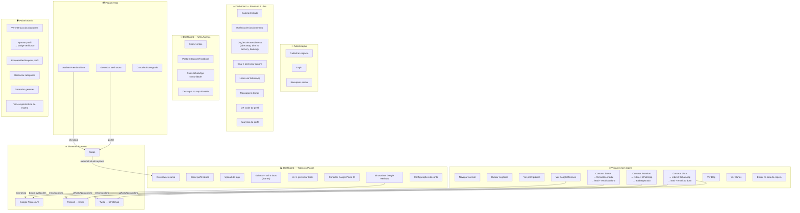

# Latino Connect — Use Case Diagram

> Instruções para gerar o diagrama visual. Cole o código abaixo em https://www.plantuml.com/plantuml ou qualquer ferramenta compatível com PlantUML.

---

## Diagrama Principal (PlantUML)

```plantuml
@startuml Latino_Connect_Use_Cases

skinparam actorStyle awesome
skinparam packageStyle rectangle
skinparam ArrowColor #1A5336
skinparam ActorBorderColor #1A5336
skinparam UseCaseBorderColor #1A5336
skinparam UseCaseBackgroundColor #F0FAF4
skinparam PackageBorderColor #CCCCCC
skinparam PackageBackgroundColor #FAFAFA
skinparam NoteBackgroundColor #FFFDE7
skinparam NoteBorderColor #EFC64E

' ─────────────────────────────────────────
' ACTORS
' ─────────────────────────────────────────
actor "Visitante\n(não autenticado)" as Visitor
actor "Dono de Negócio\n(autenticado)" as Owner
actor "Admin /\nGerente" as Admin
actor "Google Places\nAPI" as Google <<external>>
actor "Stripe" as Stripe <<external>>
actor "Resend\n(Email)" as Resend <<external>>
actor "Twilio\n(WhatsApp)" as Twilio <<external>>

' ─────────────────────────────────────────
' PACKAGE: ACESSO PÚBLICO (sem login)
' ─────────────────────────────────────────
package "Acesso Público" {

  usecase "Navegar na rede\n(Nossa Rede)" as UC_Browse
  usecase "Buscar por nome,\ncategoria ou cidade" as UC_Search
  usecase "Ver perfil\nde negócio" as UC_ViewProfile
  usecase "Ver galeria\nde fotos" as UC_Gallery
  usecase "Ver avaliações\n(Google Reviews)" as UC_Reviews
  usecase "Ver blog\ne notícias" as UC_Blog
  usecase "Ver planos\ne preços" as UC_Plans
  usecase "Entrar na\nlista de espera" as UC_Waitlist

  usecase "Contatar negócio\nStarter\n[formulário modal]" as UC_ContactStarter
  usecase "Contatar negócio\nPremium\n[redirect WhatsApp]" as UC_ContactPremium
  usecase "Contatar negócio\nUltra\n[redirect WhatsApp + email]" as UC_ContactUltra

  note right of UC_ContactStarter
    Visitante preenche:
    nome + email/WhatsApp + mensagem.
    Lead salvo → email enviado ao dono.
    Sem botão WhatsApp visível.
  end note

  note right of UC_ContactPremium
    Botão redireciona para
    WhatsApp do negócio.
    Lead registrado automaticamente.
  end note

  note right of UC_ContactUltra
    Botão redireciona para
    WhatsApp do negócio.
    Lead registrado +
    email enviado ao dono.
  end note
}

' ─────────────────────────────────────────
' PACKAGE: AUTENTICAÇÃO
' ─────────────────────────────────────────
package "Autenticação" {
  usecase "Cadastrar negócio\n/ organização" as UC_Register
  usecase "Fazer login" as UC_Login
  usecase "Recuperar senha" as UC_ForgotPassword
  usecase "Fazer logout" as UC_Logout
}

' ─────────────────────────────────────────
' PACKAGE: DASHBOARD — TODOS OS PLANOS
' ─────────────────────────────────────────
package "Dashboard — Todos os Planos (Starter+)" {
  usecase "Ver resumo\n(overview)" as UC_Overview
  usecase "Editar perfil básico\n(nome, descrição, categoria,\ntelefone, cidades, keywords)" as UC_EditProfile
  usecase "Fazer upload\nde logo" as UC_UploadLogo
  usecase "Galeria\n(até 3 fotos)" as UC_ManageGallery
  usecase "Ver leads\nrecebidos" as UC_ViewLeads
  usecase "Atualizar status\ndo lead" as UC_UpdateLead
  usecase "Configurar conta\ne aparência" as UC_Settings
  usecase "Conectar\nGoogle Place ID" as UC_ConnectGoogle
  usecase "Sincronizar\nGoogle Reviews" as UC_SyncReviews

  note right of UC_ManageGallery
    Starter: máximo 3 fotos.
    Horários, opções de atendimento
    e cupons são bloqueados
    (locked) no dashboard.
  end note
}

' ─────────────────────────────────────────
' PACKAGE: DASHBOARD — PREMIUM + ULTRA
' ─────────────────────────────────────────
package "Dashboard — Premium & Ultra" {
  usecase "Galeria ilimitada\nde fotos" as UC_UnlimitedGallery
  usecase "Configurar horários\nde funcionamento" as UC_SetHours
  usecase "Configurar opções\nde atendimento\n(take away, dine in, delivery, booking)" as UC_ServiceOptions
  usecase "Criar e gerenciar\ncupons" as UC_ManageCoupons
  usecase "Receber leads\nvia WhatsApp" as UC_LeadWhatsApp
  usecase "Mensagens diretas\nno dashboard" as UC_DirectMessages
  usecase "Gerar e baixar\nQR Code" as UC_QRCode
  usecase "Ver analytics\ndo perfil" as UC_Analytics

  note right of UC_SetHours
    Horários e opções de atendimento
    são exclusivos de Premium+.
    Não aparecem no perfil público
    de negócios Starter.
  end note
}

' ─────────────────────────────────────────
' PACKAGE: DASHBOARD — ULTRA APENAS
' ─────────────────────────────────────────
package "Dashboard — Ultra Apenas" {
  usecase "Criar e gerenciar\neventos" as UC_Events
  usecase "Publicar posts\nno Instagram/Facebook" as UC_SocialPosts
  usecase "Publicar no\nWhatsApp da comunidade" as UC_WhatsAppCommunity
  usecase "Destaque no\ntopo da rede" as UC_TopPlacement
}

' ─────────────────────────────────────────
' PACKAGE: PAGAMENTOS
' ─────────────────────────────────────────
package "Pagamentos" {
  usecase "Assinar plano\nPremium ou Ultra" as UC_Subscribe
  usecase "Gerenciar assinatura\n(portal Stripe)" as UC_ManageSub
  usecase "Fazer downgrade\n/ cancelar" as UC_Downgrade
  usecase "Receber confirmação\nde pagamento" as UC_PaymentConfirm
}

' ─────────────────────────────────────────
' PACKAGE: PAINEL ADMIN
' ─────────────────────────────────────────
package "Painel Admin" {
  usecase "Ver métricas\nda plataforma" as UC_AdminMetrics
  usecase "Aprovar perfil\n(badge verificado)" as UC_ApproveBusiness
  usecase "Bloquear /\ndesbloquear perfil" as UC_LockBusiness
  usecase "Gerenciar\ncategorias" as UC_AdminCategories
  usecase "Gerenciar\ngerentes" as UC_AdminManagers
  usecase "Ver lista\nde espera" as UC_AdminWaitlist
  usecase "Exportar lista\nde espera (CSV)" as UC_ExportWaitlist
}

' ─────────────────────────────────────────
' VISITOR RELATIONSHIPS
' ─────────────────────────────────────────
Visitor --> UC_Browse
Visitor --> UC_Search
Visitor --> UC_ViewProfile
Visitor --> UC_Gallery
Visitor --> UC_Reviews
Visitor --> UC_Blog
Visitor --> UC_Plans
Visitor --> UC_Waitlist
Visitor --> UC_Register
Visitor --> UC_Login
Visitor --> UC_ContactStarter
Visitor --> UC_ContactPremium
Visitor --> UC_ContactUltra

' ─────────────────────────────────────────
' OWNER RELATIONSHIPS
' ─────────────────────────────────────────
Owner --> UC_Login
Owner --> UC_Logout
Owner --> UC_ForgotPassword
Owner --> UC_Overview
Owner --> UC_EditProfile
Owner --> UC_UploadLogo
Owner --> UC_ManageGallery
Owner --> UC_ViewLeads
Owner --> UC_UpdateLead
Owner --> UC_Settings
Owner --> UC_ConnectGoogle
Owner --> UC_SyncReviews
Owner --> UC_Subscribe
Owner --> UC_ManageSub
Owner --> UC_Downgrade

' Premium + Ultra
Owner --> UC_UnlimitedGallery
Owner --> UC_SetHours
Owner --> UC_ServiceOptions
Owner --> UC_ManageCoupons
Owner --> UC_LeadWhatsApp
Owner --> UC_DirectMessages
Owner --> UC_QRCode
Owner --> UC_Analytics

' Ultra only
Owner --> UC_Events
Owner --> UC_SocialPosts
Owner --> UC_WhatsAppCommunity
Owner --> UC_TopPlacement

' ─────────────────────────────────────────
' ADMIN RELATIONSHIPS
' ─────────────────────────────────────────
Admin --> UC_AdminMetrics
Admin --> UC_ApproveBusiness
Admin --> UC_LockBusiness
Admin --> UC_AdminCategories
Admin --> UC_AdminManagers
Admin --> UC_AdminWaitlist
Admin --> UC_ExportWaitlist

' ─────────────────────────────────────────
' EXTERNAL SYSTEM RELATIONSHIPS
' ─────────────────────────────────────────
UC_SyncReviews --> Google : <<uses>>
UC_Reviews --> Google : <<fetches>>
UC_Subscribe --> Stripe : <<checkout>>
UC_ManageSub --> Stripe : <<portal>>
UC_PaymentConfirm --> Stripe : <<webhook>>
UC_ContactStarter --> Resend : <<email to owner>>
UC_ContactUltra --> Resend : <<email to owner>>
UC_ContactPremium --> Twilio : <<WhatsApp to owner>>
UC_ContactUltra --> Twilio : <<WhatsApp to owner>>

' ─────────────────────────────────────────
' INCLUDE / EXTEND RELATIONSHIPS
' ─────────────────────────────────────────
UC_EditProfile ..> UC_Login : <<include>>
UC_Overview ..> UC_Login : <<include>>
UC_ManageCoupons ..> UC_Subscribe : <<extend>>\nse Starter
UC_Analytics ..> UC_Subscribe : <<extend>>\nse Starter
UC_SetHours ..> UC_Subscribe : <<extend>>\nse Starter
UC_ServiceOptions ..> UC_Subscribe : <<extend>>\nse Starter
UC_Events ..> UC_Subscribe : <<extend>>\nse não Ultra
UC_UnlimitedGallery ..> UC_ManageGallery : <<extends>>
UC_SyncReviews ..> UC_ConnectGoogle : <<include>>

@enduml
```



---

## Alternativa Mermaid (para GitHub / Notion)



---

## Resumo dos Atores e Responsabilidades

### Visitante (não autenticado)
Qualquer pessoa que acessa o site sem conta. Pode explorar toda a rede pública, ver perfis, avaliações do Google e entrar em contato com negócios. O modo de contato varia conforme o plano do negócio visitado.

### Dono de Negócio (autenticado)
Pessoa que cadastrou um negócio ou organização. Acesso ao dashboard varia conforme o plano:
- **Starter** — perfil básico, 3 fotos, leads por email, Google Reviews. Sem horários, sem opções de atendimento, sem cupons.
- **Premium** — tudo do Starter + galeria ilimitada, horários, opções de atendimento, cupons, leads WhatsApp, QR Code, analytics.
- **Ultra** — tudo do Premium + eventos, posts sociais, destaque no topo, leads WhatsApp + email.

### Admin / Gerente
Equipe interna da Latino Connect. Acessa `/admin` para moderar perfis, ver métricas, gerenciar categorias e exportar dados da lista de espera.

### Google Places API (externo)
Fornece as avaliações públicas do Google para os perfis cadastrados. O dono conecta seu negócio fornecendo o Google Place ID. A plataforma busca e exibe as avaliações automaticamente — sem avaliações nativas por enquanto.

### Stripe (externo)
Processa pagamentos de assinaturas Premium e Ultra. Webhooks atualizam o plano do usuário automaticamente após pagamento ou cancelamento.

### Resend — Email (externo)
Envia notificações de novos leads para donos de negócios **Starter** (formulário modal) e **Ultra** (WhatsApp + email).

### Twilio — WhatsApp (externo)
Envia notificações de novos leads via WhatsApp para donos nos planos **Premium** e **Ultra**.

---

## Fluxo de Contato por Plano (detalhado)

```
Visitante acessa perfil público de um negócio
        ↓
Sistema verifica o plano do negócio
        ↓
┌─────────────────────────────────────────────────────────┐
│ STARTER                                                 │
│  Botão "Enviar mensagem" → abre formulário modal        │
│  Visitante preenche: nome + email/WhatsApp + mensagem   │
│  Lead salvo no Supabase                                 │
│  Email enviado ao dono via Resend                       │
│  Sem botão de WhatsApp visível                          │
├─────────────────────────────────────────────────────────┤
│ PREMIUM                                                 │
│  Botão "Falar no WhatsApp" → redirect para wa.me/...   │
│  Lead registrado automaticamente no Supabase            │
│  Sem email enviado ao dono                              │
├─────────────────────────────────────────────────────────┤
│ ULTRA                                                   │
│  Botão "Falar no WhatsApp" → redirect para wa.me/...   │
│  Lead registrado automaticamente no Supabase            │
│  Email enviado ao dono via Resend                       │
└─────────────────────────────────────────────────────────┘
```

---

## O que aparece no perfil público por plano

| Seção do perfil | Starter | Premium | Ultra |
|---|---|---|---|
| Nome, descrição, categoria | ✓ | ✓ | ✓ |
| Logo | ✓ | ✓ | ✓ |
| Galeria de fotos | até 3 | ilimitado | ilimitado |
| Telefone | ✓ | ✓ | ✓ |
| Email | ✓ | ✓ | ✓ |
| Site | ✓ | ✓ | ✓ |
| Horários de funcionamento | — | ✓ | ✓ |
| Opções de atendimento | — | ✓ | ✓ |
| Cupons de desconto | — | ✓ | ✓ |
| Google Reviews | ✓ | ✓ | ✓ |
| Botão WhatsApp | — | ✓ | ✓ |
| Formulário de contato | ✓ | — | — |
| Badge verificado | ✓ | ✓ | ✓ |
| Destaque no topo | — | — | ✓ |
| Eventos | — | — | ✓ |

---

## Fluxo de Moderação de Perfis

```
Dono cadastra negócio
        ↓
Perfil aparece na rede com badge "Em verificação"
        ↓
Admin revisa no painel /admin/businesses
        ↓
    ┌───────────┐
    │  Aprovar  │ → Badge "Verificado" aparece no perfil público
    └───────────┘
    ┌───────────┐
    │ Bloquear  │ → Perfil removido da rede pública
    └───────────┘
```

---

## Fluxo de Google Reviews

```
Dono acessa Dashboard → seção Avaliações
        ↓
Informa o Google Place ID do negócio
        ↓
Sistema chama Google Places API
        ↓
Avaliações armazenadas em cache no Supabase
        ↓
Exibidas no perfil público (/business/$slug)
        ↓
Sincronização automática periódica (a cada 24h)
```

---

## Fluxo de Pagamento

```
Dono acessa /dashboard/upgrade
        ↓
Seleciona Premium (NZ$49/mês) ou Ultra (NZ$99/mês)
        ↓
Redirecionado para Stripe Checkout
        ↓
Pagamento processado pelo Stripe
        ↓
Stripe envia webhook → handleStripeWebhook()
        ↓
profiles.plan_tier atualizado no Supabase
        ↓
Dono retorna ao dashboard com novo plano ativo
        ↓
Funcionalidades desbloqueadas imediatamente
```
